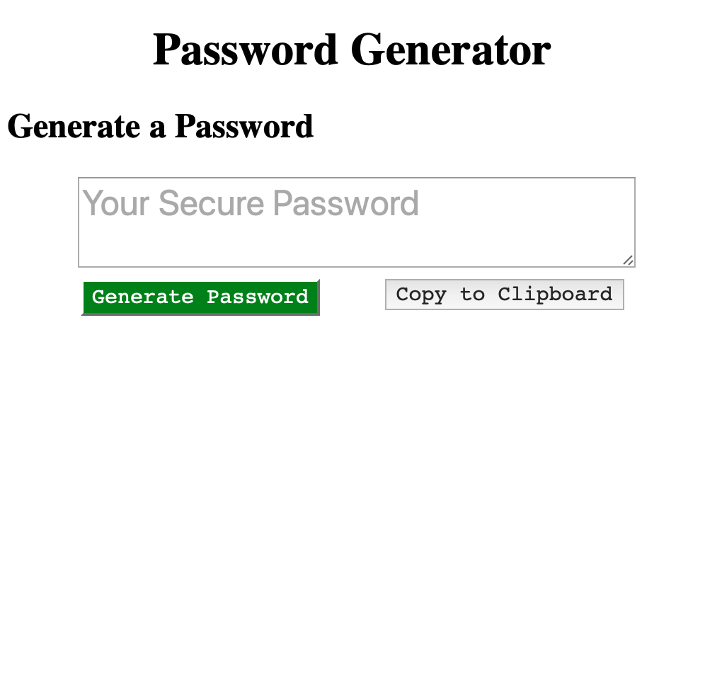

# random-password-generator
This password generator generates a random password that is 12 characters long and consists of numbers, lowercase letters, 
uppercase letters and special characters.
To generate your password, just press the "Generate Password" button. In the text box, a randomized password should appear. 

